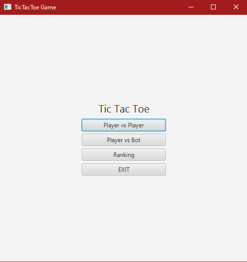
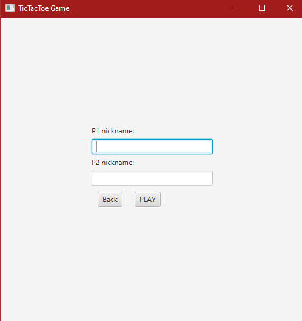
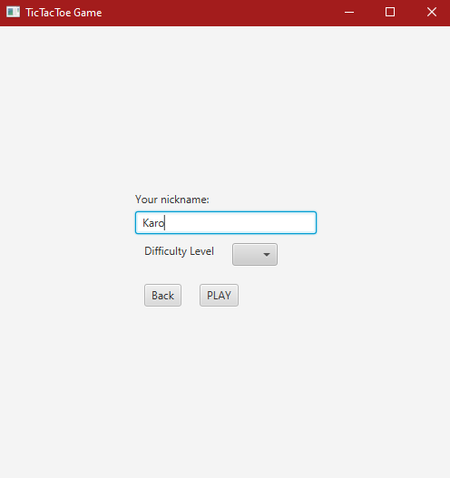
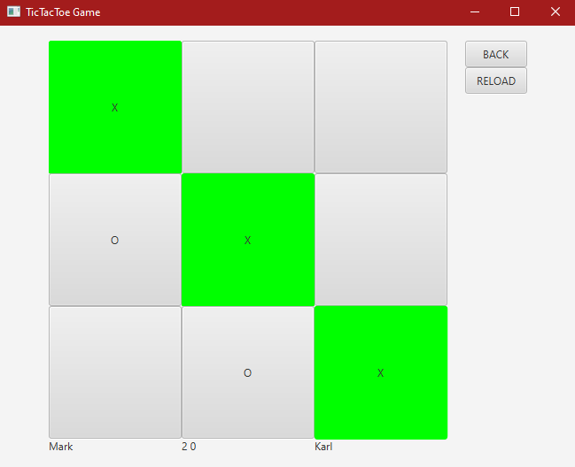
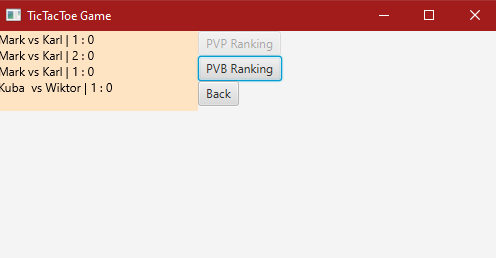

# Tic-Tac-Toe Game

    - Introduction
    - Screenshots
    - Technology
    
**Introduction:**
    
     It is a project of the popular TicTacToe game. Two game modes are currently available:
                - PvP (offline)
                - PvE (Only the easy level so far, in the future a difficult level will be implemented based on the MinMax algorithm)
                
                
**Screenshots:**

Main Menu

PvP Menu 

PvB Menu

Board 

Ranking 

**Technology**
 - Java 
 - JavaFX
 - Gradle

    